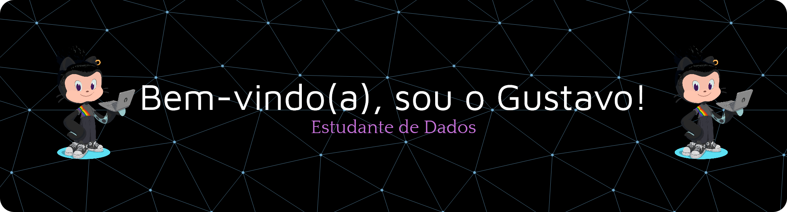

###
# 💫 Sobre mim:
⛱️ - Amo jogos ( especialmente puzzles ), Mario Party e claro, codar! 💻 - Formado em ADS na UNICSUL 💙 - Aluno destaque - Equipe 5, PROA, 2024.02 🌱 - Atualmente aprendendo React, Redux e AWS 📌 - São Paulo, SP

## 🌐 Onde me encontrar:
   

# 💻 Tecnologias:

  
  
  
  
  
  
  
  
  
  
  
  
  
  
  
  
  
  
  
  
  
  
  
  
  
  
  

---

 
 

---

###

###